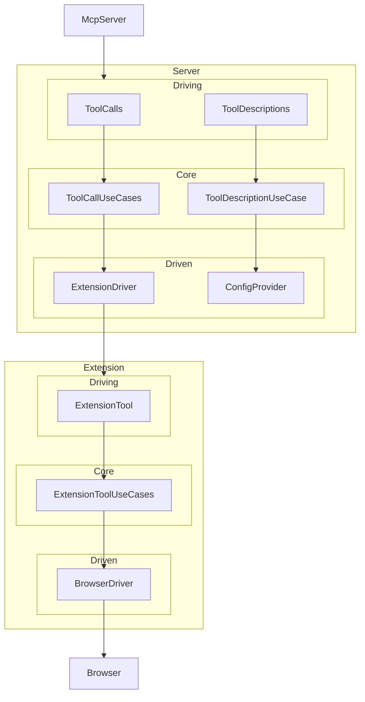
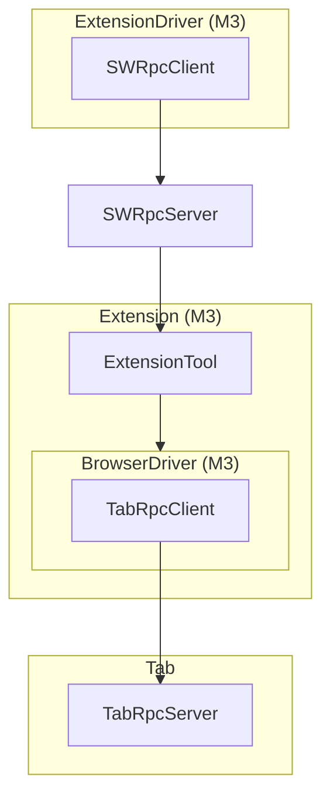

- [Overall Architecture](#overall-architecture)
- [M3 Architecture](#m3-architecture)
- [M2 Architecture](#m2-architecture)

# Overall Architecture

```mermaid
flowchart TD
  McpServer

  subgraph Server
    subgraph ServerDriving["Driving"]
      ToolCalls 
      ToolDescriptions
    end
    subgraph ServerCore["Core"]
      ToolCallUseCases
      ToolDescriptionUseCase
    end

    
    subgraph ServerDriven["Driven"]
      ExtensionDriver
      ConfigProvider["ConfigProvider"]
    end

    ToolCalls --> ToolCallUseCases
    ToolCallUseCases --> ExtensionDriver
    ToolDescriptions --> ToolDescriptionUseCase
    ToolDescriptionUseCase --> ConfigProvider
  end

  McpServer-->ServerDriving

  subgraph Extension
    subgraph ExtensionDriving["Driving"]
      ExtensionTool
    end

    subgraph ExtensionCore["Core"]
      ExtensionToolUseCases
    end
    subgraph ExtensionDriven["Driven"]
      BrowserDriver
    end

    ExtensionTool --> ExtensionToolUseCases
    ExtensionToolUseCases -->BrowserDriver
  end

  Browser

  ExtensionDriver --> ExtensionDriving
  BrowserDriver --> Browser
```

# M3 Architecture

```mermaid
flowchart TD
  subgraph ExtensionDriver["ExtensionDriver (M3)"]
    SWRpcClient
  end
  subgraph Tab
    TabRpcServer
    SWRpcClient
  end
  subgraph BrowserDriver["BrowserDriver (M3)"]
    TabRpcClient
  end
  SWRpcServer
  SWRpcServer
  subgraph Extension["Extension (M3)"]
    ExtensionTool
    BrowserDriver
  end
  Tab
  SWRpcClient --> SWRpcServer
  SWRpcServer --> ExtensionTool
  ExtensionTool --> BrowserDriver
  TabRpcClient --> TabRpcServer
```

# M2 Architecture
