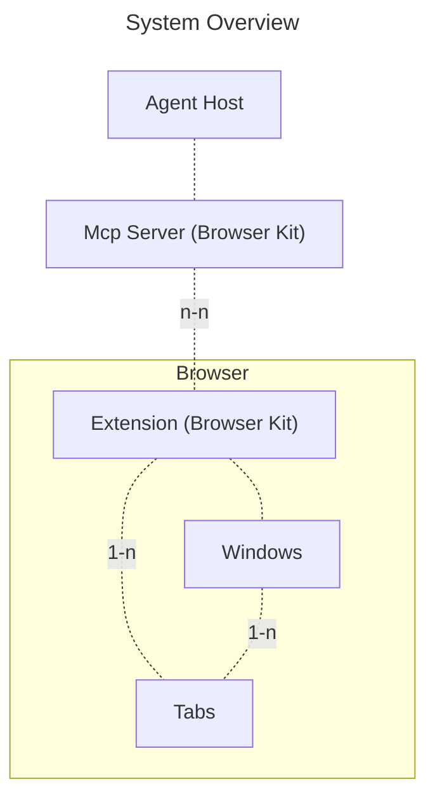
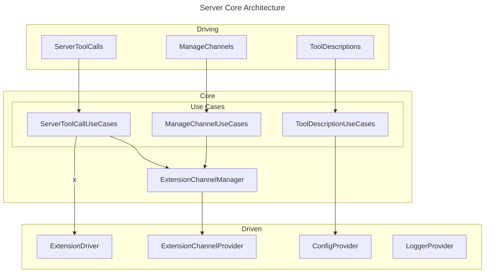
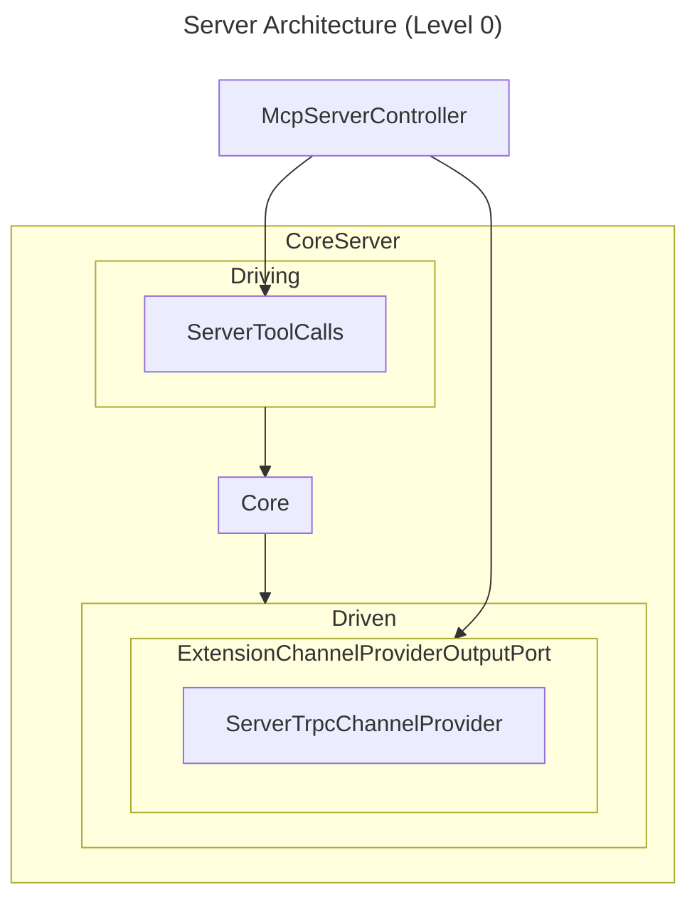
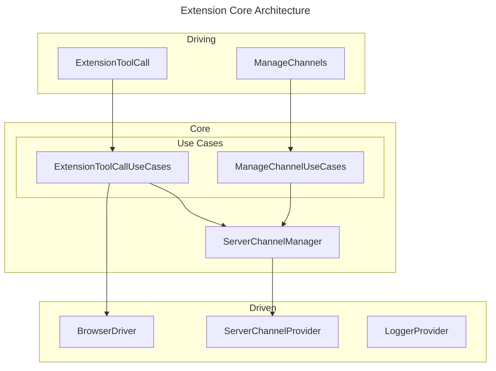
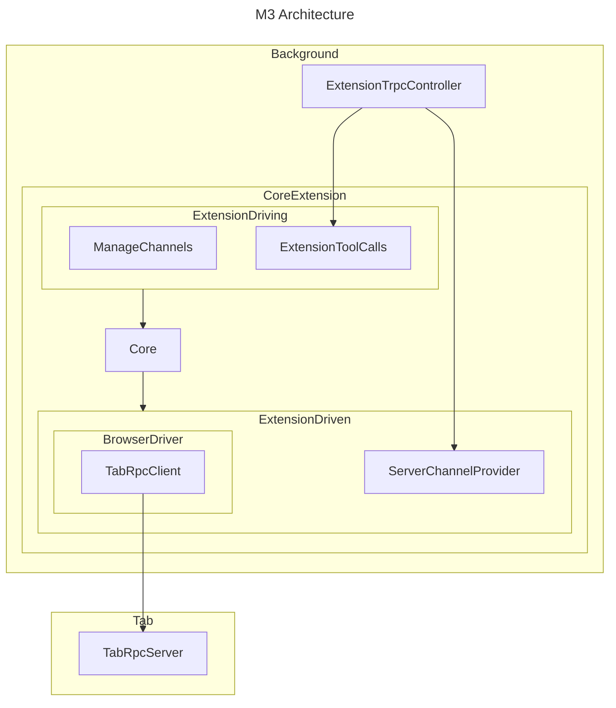

- [System Overview](#system-overview)
- [Server Core Architecture (Level 0)](#server-core-architecture-level-0)
- [Server Architecture (Level 0)](#server-architecture-level-0)
- [Extension Core Architecture (Level 0)](#extension-core-architecture-level-0)
- [Extension Architecture (Level 0)](#extension-architecture-level-0)

# System Overview

# Server Core Architecture (Level 0)

# Server Architecture (Level 0)

# Extension Core Architecture (Level 0)

# Extension Architecture (Level 0)

