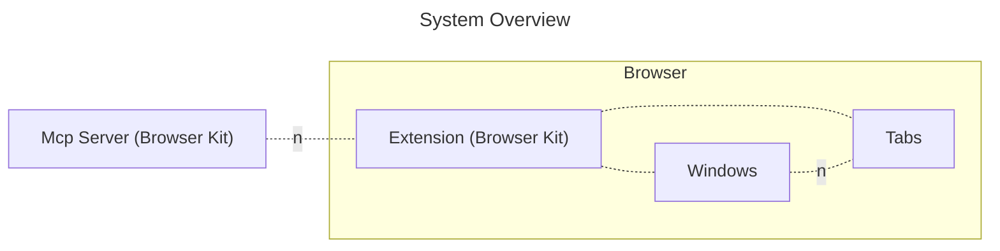
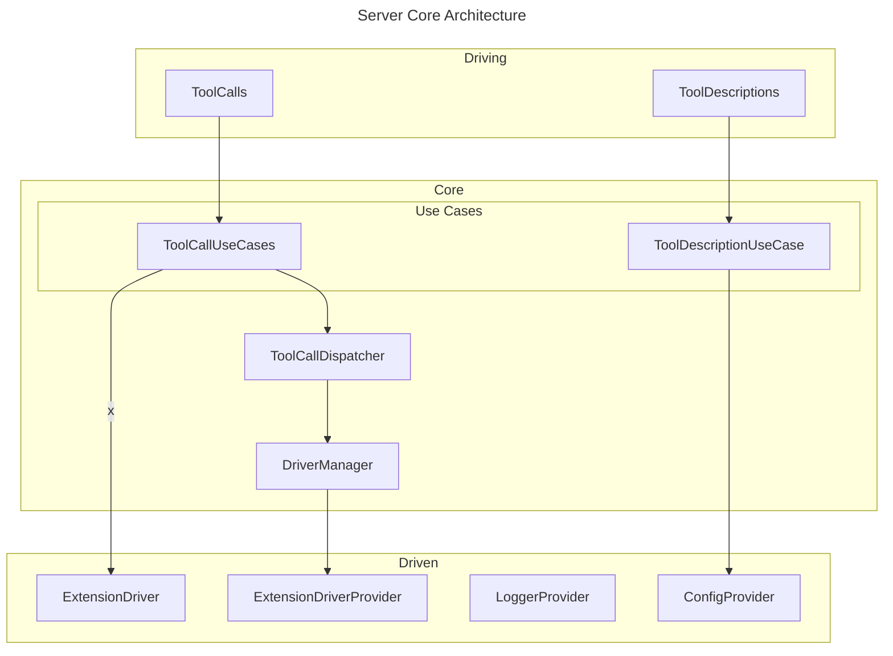
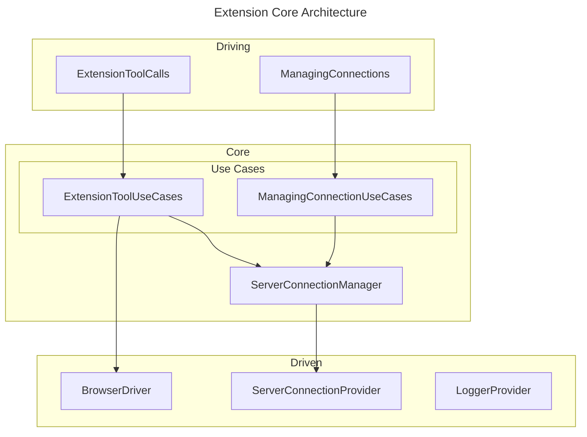
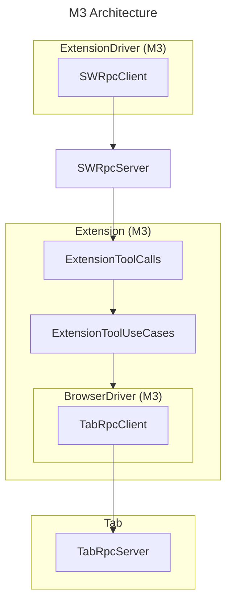

- [System Overview](#system-overview)
- [Server Core Architecture (Level 0)](#server-core-architecture-level-0)
- [Extension Core Architecture (Level 0)](#extension-core-architecture-level-0)
- [M3 Architecture](#m3-architecture)
- [M2 Architecture](#m2-architecture)

# System Overview

```mermaid
---
title: System Overview
---
flowchart LR
  McpServer["Mcp Server (Browser Kit)"]
  Extensions
  Browser

  subgraph Browser
    Windows
    Tabs
    Extensions["Extension (Browser Kit)"]
  end

  McpServer -.-|"n"| Extensions
  Extensions -.- Tabs
  Extensions -.- Windows
  Windows -.-|"n"| Tabs
```

# Server Core Architecture (Level 0)

```mermaid
---
title: Server Core Architecture
---
flowchart TD
  subgraph ServerDriving["Driving"]
    ToolCalls
    ToolDescriptions
  end

  subgraph ServerCore["Core"]
    subgraph UseCases["Use Cases"]
      ToolCallUseCases
      ToolDescriptionUseCase
    end
    DriverManager
    ToolCallDispatcher
  end

  subgraph ServerDriven["Driven"]
    ExtensionDriver
    ConfigProvider["ConfigProvider"]
    LoggerProvider["LoggerProvider"]
    ExtensionDriverProvider
  end

  ToolCalls --> ToolCallUseCases
  ToolDescriptions --> ToolDescriptionUseCase
  ToolCallUseCases --"x"--> ExtensionDriver
  ToolDescriptionUseCase --> ConfigProvider
  ToolCallUseCases--> ToolCallDispatcher
  ToolCallDispatcher --> DriverManager
  DriverManager --> ExtensionDriverProvider

```

# Extension Core Architecture (Level 0)

```mermaid
---
title: Extension Core Architecture
---
flowchart TD
  subgraph Driving["Driving"]
    ExtensionToolCalls
    ManagingConnections
  end
  subgraph ExtensionCore["Core"]
    subgraph UseCases["Use Cases"]
      ExtensionToolUseCases
      ManagingConnectionUseCases
    end
    ServerConnectionManager
  end
  subgraph Driven["Driven"]
    BrowserDriver
    ServerConnectionProvider
    LoggerProvider
  end

  %% From Driving
  ExtensionToolCalls --> ExtensionToolUseCases
  ManagingConnections --> ManagingConnectionUseCases
  %% From Core
  ExtensionToolUseCases --> BrowserDriver
  ExtensionToolUseCases --> ServerConnectionManager
  ManagingConnectionUseCases --> ServerConnectionManager
  ServerConnectionManager --> ServerConnectionProvider
```

# M3 Architecture

```mermaid
---
title: M3 Architecture
---
flowchart TD
  subgraph ExtensionDriver["ExtensionDriver (M3)"]
    SWRpcClient
  end
  subgraph Tab
    TabRpcServer
    SWRpcClient
  end
  subgraph BrowserDriver["BrowserDriver (M3)"]
    TabRpcClient
  end
  SWRpcServer
  subgraph Extension["Extension (M3)"]
    ExtensionToolCalls
    ExtensionToolUseCases
    BrowserDriver
  end
  Tab
  SWRpcClient --> SWRpcServer
  SWRpcServer --> ExtensionToolCalls
  ExtensionToolCalls --> ExtensionToolUseCases
  ExtensionToolUseCases --> BrowserDriver
  TabRpcClient --> TabRpcServer
```

# M2 Architecture
