# L0 - System Overview

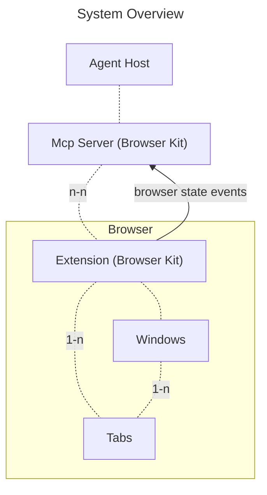
```mermaid
---
title: System Overview
---
flowchart TB
  AgentHost["Agent Host"]
  McpServer["Mcp Server (Browser Kit)"]
  Extensions
  Browser

  subgraph Browser
    Windows
    Tabs
    Extensions["Extension (Browser Kit)"]
  end

  AgentHost -.- McpServer
  McpServer -.-|"n-n"| Extensions
  Extensions -->|"browser state events"| McpServer
  Extensions -.-|"1-n"| Tabs
  Extensions -.- Windows
  Windows -.-|"1-n"| Tabs
```

# L1 - Server Core

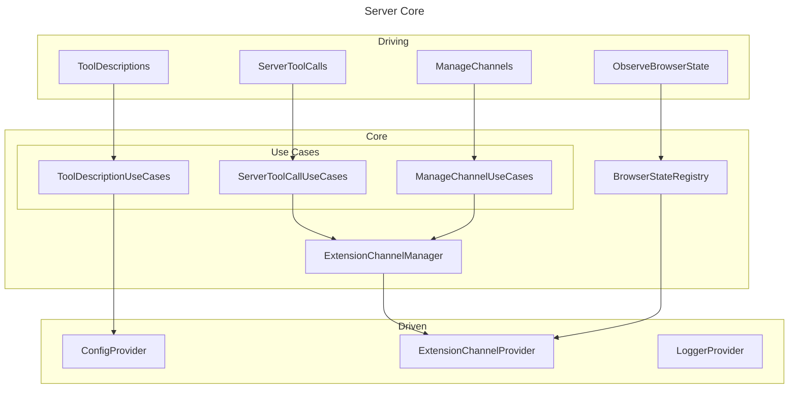
```mermaid
---
title: Server Core
---
flowchart TD
  subgraph ServerDriving["Driving"]
    ServerToolCalls
    ManageChannels
    ToolDescriptions
    ObserveBrowserState
  end

  subgraph ServerCore["Core"]
    subgraph UseCases["Use Cases"]
      ServerToolCallUseCases
      ManageChannelUseCases
      ToolDescriptionUseCases
    end
    ExtensionChannelManager
    BrowserStateRegistry
  end

  subgraph ServerDriven["Driven"]
    ConfigProvider["ConfigProvider"]
    ExtensionChannelProvider
    LoggerProvider["LoggerProvider"]
  end

  %% From Driving
  ServerToolCalls --> ServerToolCallUseCases
  ToolDescriptions --> ToolDescriptionUseCases
  ManageChannels --> ManageChannelUseCases
  ObserveBrowserState --> BrowserStateRegistry
  %% From Core
  ServerToolCallUseCases--> ExtensionChannelManager
  ManageChannelUseCases --> ExtensionChannelManager
  ExtensionChannelManager --> ExtensionChannelProvider
  BrowserStateRegistry --> ExtensionChannelProvider
  ToolDescriptionUseCases --> ConfigProvider

```

# L1 - Server

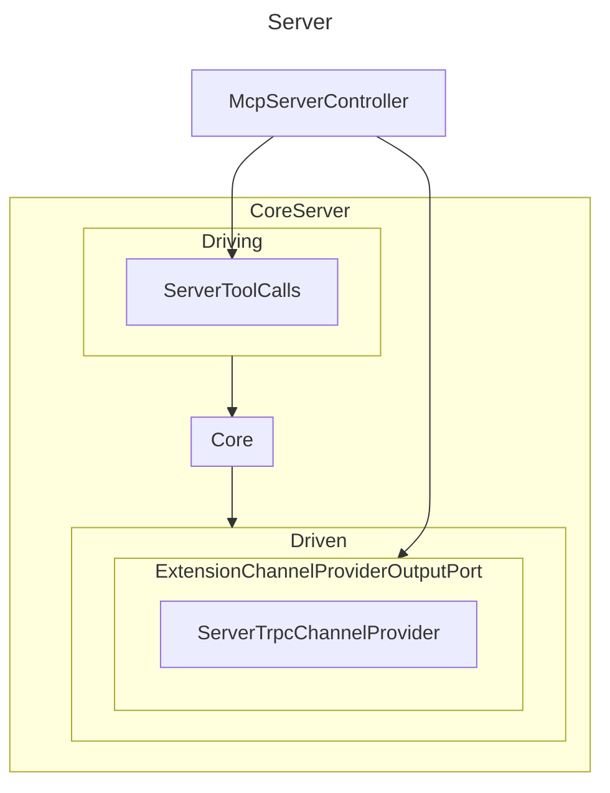
```mermaid
---
title: Server
---
flowchart TD
  McpServerController
  subgraph ServerDriving["Driving"]
    ServerToolCalls
  end
  subgraph ServerCore["Core"]

  end
  subgraph ServerDriven["Driven"]
    subgraph ExtensionChannelProviderOutputPort
      ServerTrpcChannelProvider
    end
  end
  subgraph CoreServer
    ServerDriving
    ServerCore
    ServerDriven
  end

  %% From Driving
  ServerDriving --> ServerCore
  %% From Core
  ServerCore --> ServerDriven
  %% From Controller
  McpServerController --> ServerToolCalls
  McpServerController --> ExtensionChannelProviderOutputPort
```

# L1 - Extension Core

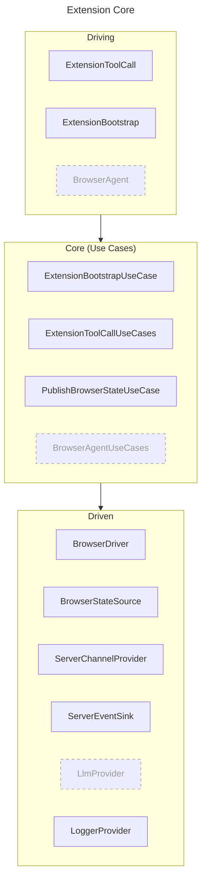
```mermaid
---
title: Extension Core
---
flowchart 
  subgraph Driving["Driving"]
    direction LR
    ExtensionToolCall
    ExtensionBootstrap
    BrowserAgent
  end
  subgraph Core["Core (Use Cases)"]
    direction LR
    ExtensionBootstrapUseCase
    ExtensionToolCallUseCases
    PublishBrowserStateUseCase
    BrowserAgentUseCases
  end
  subgraph Driven["Driven"]
    direction LR
    BrowserDriver
    BrowserStateSource
    ServerChannelProvider
    ServerEventSink
    LlmProvider
    LoggerProvider
  end

  Driving --> Core --> Driven

  classDef planned stroke-dasharray:5 5,stroke:#999,color:#999;
  class BrowserAgent,BrowserAgentUseCases,LlmProvider planned;
```

## L2 - Extension Tool Calls

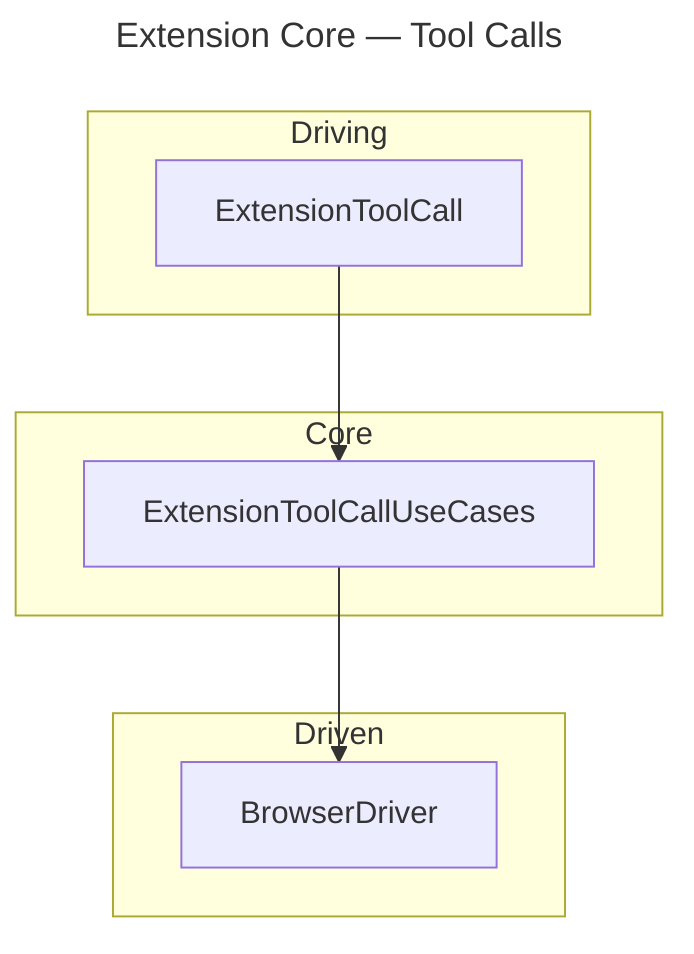
```mermaid
---
title: Extension Core — Tool Calls
---
flowchart TB
  subgraph Driving["Driving"]
    ExtensionToolCall
  end
  subgraph Core["Core"]
    ExtensionToolCallUseCases
  end
  subgraph Driven["Driven"]
    BrowserDriver
  end
  ExtensionToolCall --> ExtensionToolCallUseCases
  ExtensionToolCallUseCases --> BrowserDriver
```

## L2 - Browser-State Publishing

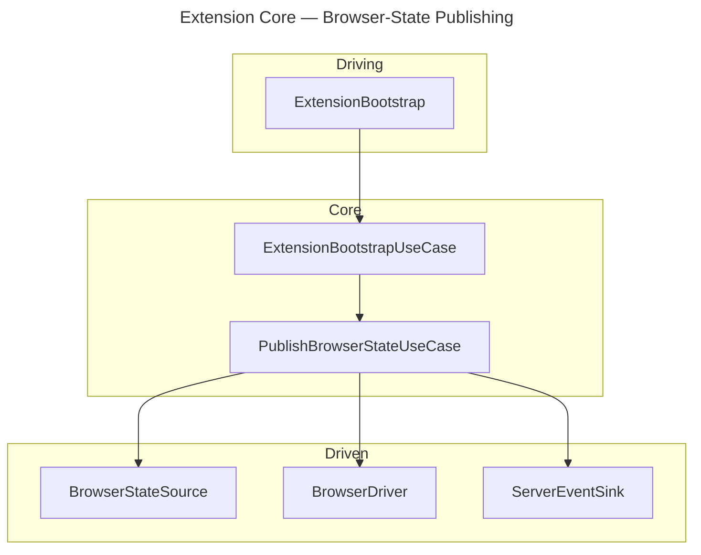
```mermaid
---
title: Extension Core — Browser-State Publishing
---
flowchart TB
  subgraph Driving["Driving"]
    ExtensionBootstrap
  end
  subgraph Core["Core"]
    ExtensionBootstrapUseCase
    PublishBrowserStateUseCase
  end
  subgraph Driven["Driven"]
    BrowserStateSource
    BrowserDriver
    ServerEventSink
  end
  ExtensionBootstrap --> ExtensionBootstrapUseCase
  ExtensionBootstrapUseCase --> PublishBrowserStateUseCase
  PublishBrowserStateUseCase --> BrowserStateSource
  PublishBrowserStateUseCase --> BrowserDriver
  PublishBrowserStateUseCase --> ServerEventSink
```

## L2 - Browser Agent (planned)

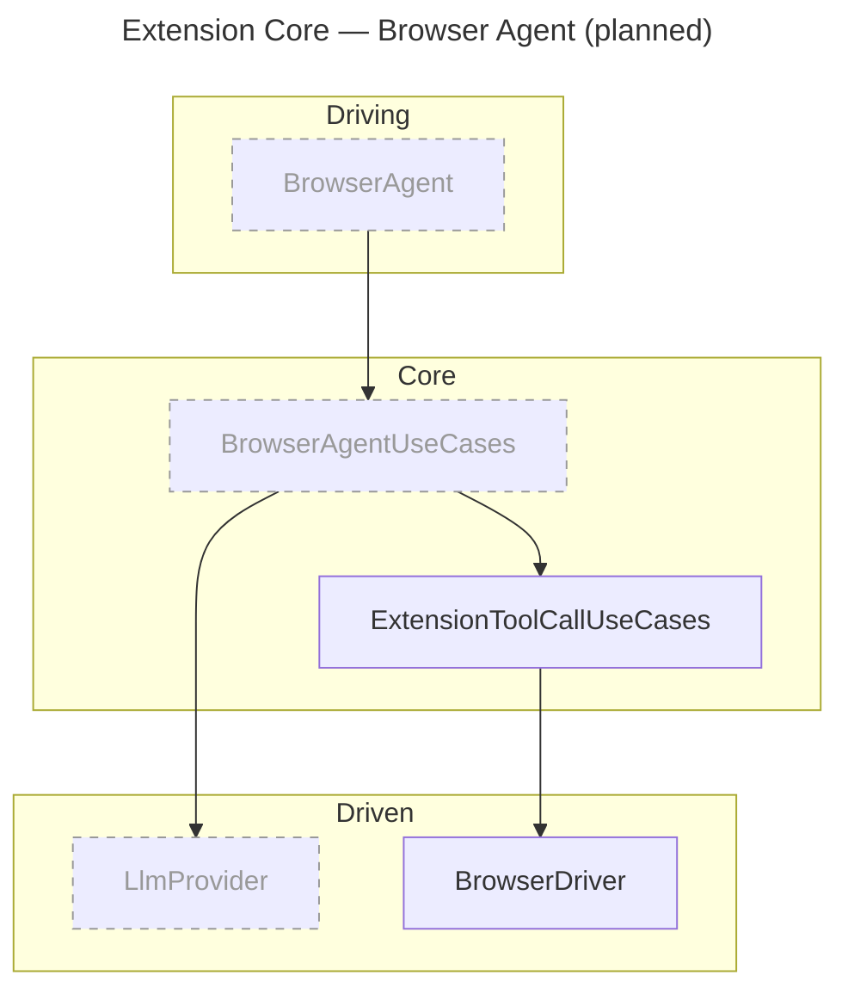
```mermaid
---
title: Extension Core — Browser Agent (planned)
---
flowchart TB
  subgraph Driving["Driving"]
    BrowserAgent
  end
  subgraph Core["Core"]
    BrowserAgentUseCases
    ExtensionToolCallUseCases
  end
  subgraph Driven["Driven"]
    LlmProvider
    BrowserDriver
  end
  BrowserAgent --> BrowserAgentUseCases
  BrowserAgentUseCases --> LlmProvider
  BrowserAgentUseCases --> ExtensionToolCallUseCases
  ExtensionToolCallUseCases --> BrowserDriver

  classDef planned stroke-dasharray:5 5,stroke:#999,color:#999;
  class BrowserAgent,BrowserAgentUseCases,LlmProvider planned;
```

# L1 - Extension Architecture

All components grouped by runtime (the deployment "layers"); the channel sub-diagrams below detail
each cross-runtime link. `CoreExtension` internals are in
[Extension Core Architecture](#extension-core-architecture-level-0).

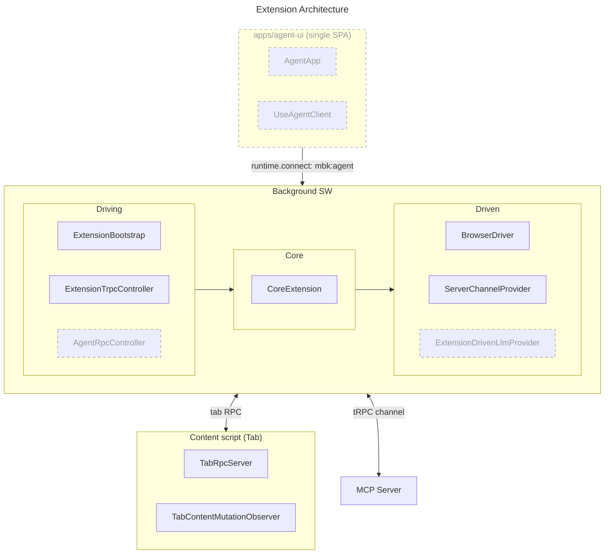
```mermaid
---
title: Extension Architecture
---
flowchart TB
  subgraph AgentUi["apps/agent-ui (single SPA)"]
    direction LR
    AgentApp
    UseAgentClient
  end
  subgraph Background["Background SW"]
    subgraph BgDriving["Driving"]
      direction LR
      ExtensionBootstrap
      ExtensionTrpcController
      AgentRpcController
    end
    subgraph BgCore["Core"]
      CoreExtension
    end
    subgraph BgDriven["Driven"]
      direction LR
      BrowserDriver
      ServerChannelProvider
      ExtensionDrivenLlmProvider
    end
    BgDriving --> BgCore --> BgDriven
  end
  subgraph Tab["Content script (Tab)"]
    direction LR
    TabRpcServer
    TabContentMutationObserver
  end
  Server["MCP Server"]

  AgentUi -->|"runtime.connect: mbk:agent"| Background
  Background <-->|"tab RPC"| Tab
  Background <-->|"tRPC channel"| Server

  classDef planned stroke-dasharray:5 5,stroke:#999,color:#999;
  class AgentUi,AgentApp,UseAgentClient,AgentRpcController,ExtensionDrivenLlmProvider planned;
```

## L2 - Channel — Background ⇄ Tab

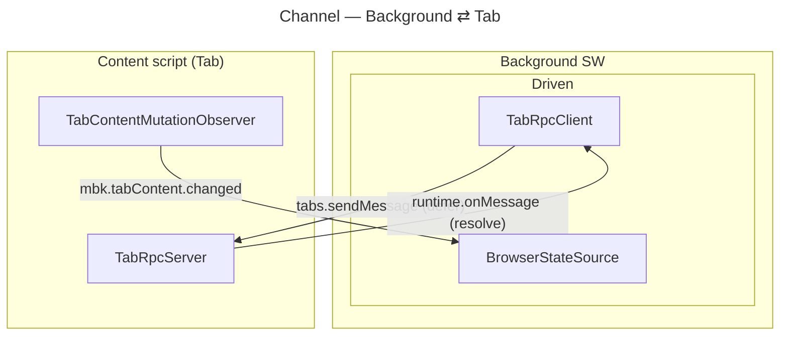
```mermaid
---
title: Channel — Background ⇄ Tab
---
flowchart TB
  subgraph BG["Background SW"]
    subgraph Driven["Driven"]
      direction LR
      TabRpcClient
      BrowserStateSource
    end
  end
  subgraph TabRt["Content script (Tab)"]
    TabRpcServer
    TabContentMutationObserver
  end

  TabRpcClient -->|"tabs.sendMessage (defer)"| TabRpcServer
  TabRpcServer -->|"runtime.onMessage (resolve)"| TabRpcClient
  TabContentMutationObserver -->|"mbk.tabContent.changed"| BrowserStateSource
```

## L2 - Channel — Background ⇄ MCP Server

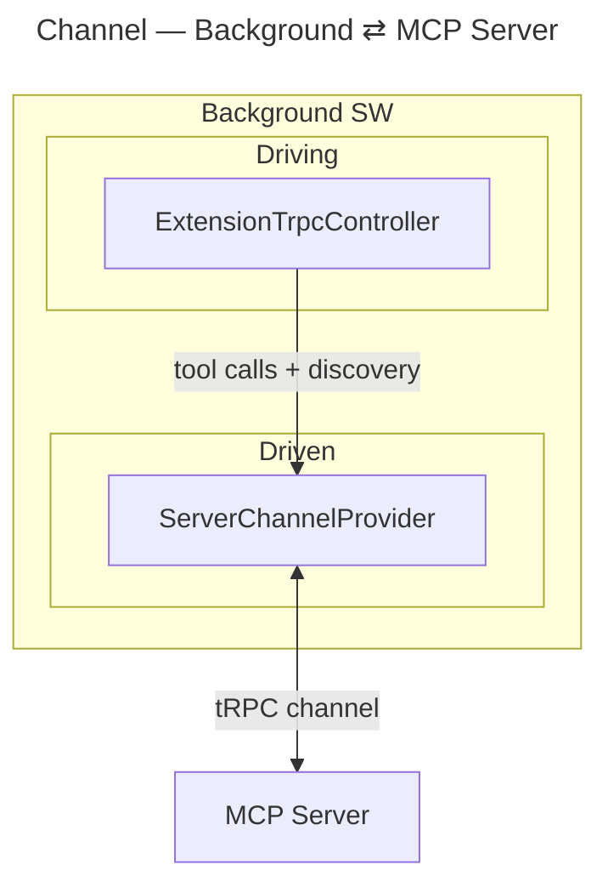
```mermaid
---
title: Channel — Background ⇄ MCP Server
---
flowchart TB
  subgraph BG["Background SW"]
    subgraph Driving["Driving"]
      ExtensionTrpcController
    end
    subgraph Driven["Driven"]
      ServerChannelProvider
    end
  end
  Server["MCP Server"]

  ExtensionTrpcController -->|"tool calls + discovery"| ServerChannelProvider
  ServerChannelProvider <-->|"tRPC channel"| Server
```

## L2 - Browser Agent Architecture

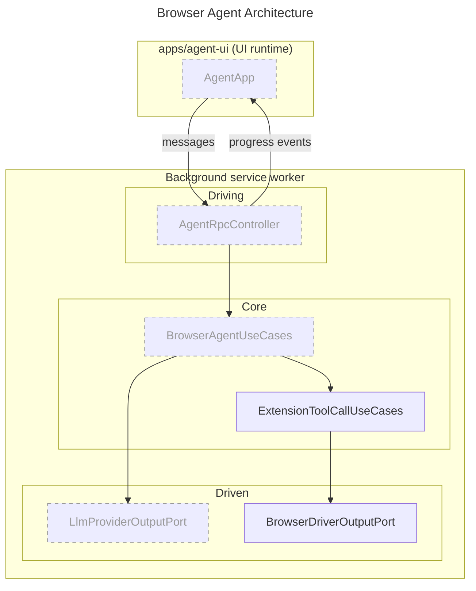
```mermaid
---
title: Browser Agent Architecture
---
flowchart TD
  subgraph AgentUi["apps/agent-ui (UI runtime)"]
    AgentApp["AgentApp"]
  end

  subgraph BackgroundSW["Background service worker"]
    subgraph Driving["Driving"]
      AgentRpcController["AgentRpcController"]
    end
    subgraph Core["Core"]
      BrowserAgentUseCases["BrowserAgentUseCases"]
      ExtensionToolCallUseCases["ExtensionToolCallUseCases"]
    end
    subgraph Driven["Driven"]
      direction LR
      LlmProvider["LlmProviderOutputPort"]
      BrowserDriver["BrowserDriverOutputPort"]
    end
  end

  AgentApp -->|"messages"| AgentRpcController
  AgentRpcController -->|"progress events"| AgentApp
  AgentRpcController --> BrowserAgentUseCases
  BrowserAgentUseCases --> LlmProvider
  BrowserAgentUseCases --> ExtensionToolCallUseCases
  ExtensionToolCallUseCases --> BrowserDriver

  classDef planned stroke-dasharray:5 5,stroke:#999,color:#999;
  class AgentApp,AgentApp,AgentRpcController,BrowserAgentUseCases,LlmProvider planned;
```
